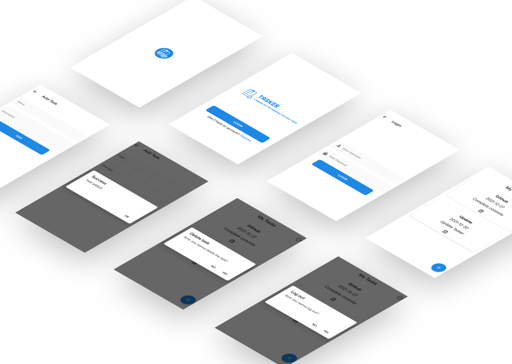

<p align="center">
    <a href="https://expo.dev/@freaker/tasker">
        
    </a>
    <h1 align="center"> Tasker </h1>
</p>

<p align="center">
    A minimal android app to manage your daily tasks.
</p>

<p align="center">
    This repository consists of a <strong>React Native Application</strong> built with <strong>Expo CLI</strong>.
</p>

## App Showcase

<p align="center">
    
</p>

## Acknowledgements

-   [Expo](https://expo.dev/)
-   [Formik](https://formik.org/)
-   [Yup](https://github.com/jquense/yup)
-   [Apisauce](https://github.com/infinitered/apisauce)

## Application features

-   `Screens` - Welcome, Register, Login, Add Task, View Tasks.

-   `Animation` - Activity Indicator & React-Spinner

-   `Authentication` - User authentication (Register, Login/out).

-   `Cache Layer` - Caching API Data.

-   `Custom and Reusable Hooks` - API and Client.

-   `Form Validation` - Using Formik.

-   `Gesture Handler` - Pull to refresh.

-   `Navigation` - Using React Navigation and Stack Navigator.

-   `Reusable Components` - Button, Icon, Forms, Screen, Text, Text Input and more.

## Run Locally

Clone the project

```bash
  git clone https://github.com/ayush-rathore/tasker
```

Go to the project directory

```bash
  cd tasker
```

Install dependencies

```bash
  npm install
```

Start the expo server

```bash
  expo start
```

## Environment Variables

To run this project, you'll need to create a `.env` file in `backend` with the following env variables

`PORT`

`MONGO_URI`

## Tech Stack

**Client:** React-Native, Expo-SDK

**Server:** Node, Express

**Database:** MongoDB

## Contributing

Contributions are always welcome!

## Feedback

If you have any feedback, please reach out to me at heyfreaker@gmail.com
